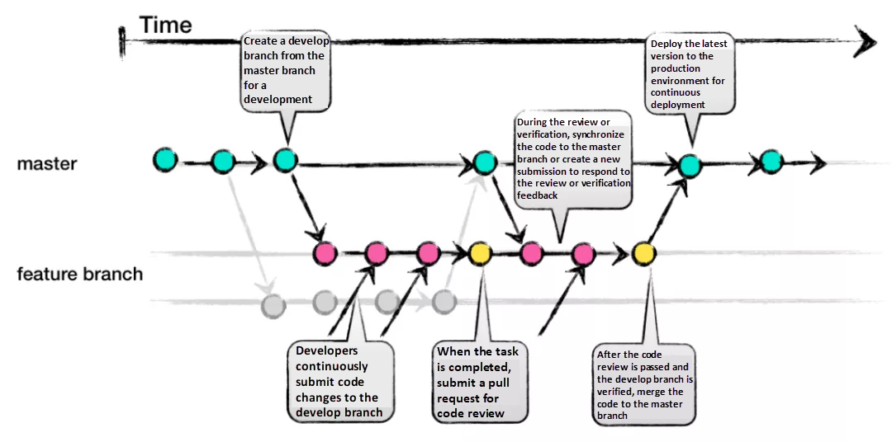

## Hi there 👋

## Frontend

A continuación se encuentra el link que redirecciona al Frontend de prueba:
 [Elpis-Frontend](https://frontend-213f.onrender.com/) 

## Backend

En el siguiente link dirige al Backend de prueba:
 [Elpis-Backend](https://backend-gh0t.onrender.com/) 
 

## Convenciones 

### Commits

En el desarrollo del proyecto se utilizará [Convencional-Commits](https://www.conventionalcommits.org/en/v1.0.0/) para realizar los commits con nombres y descripciones sencillas de leer. Además para indicar el tipo vamos a utilizar [Gitmojis](https://gitmoji.dev/) para que sean más identificables a simple vista. **Todo** commit estará compuesto de un título, en inglés; y un cuerpo escrito en español, el cual es opcional, sólo por si se deben añadir más detalles al respecto del commit. 

En la siguiente sección daremos una guía rápida para la forma en que se utilizarán los conventional commits.

**Guía Rápida de Conventional Commits**

Un mensaje de commit sigue la siguiente forma:

`<tipo>` `<descripción>`

1. **Formato del Mensaje de Commit**:
   - **Tipo**: Define el tipo de cambio (e.g., `feat`, `fix`, `docs`, `style`, `refactor`, `test`, `chore`) utilizando un [Gitmoji](https://gitmoji.dev/).
   - **Descripción**: Proporciona una breve descripción del cambio.
   - **Cuerpo** (opcional): Ofrece detalles adicionales sobre el cambio, si es necesario.

2. **Ejemplos de Mensajes de Commit**:
   - `:memo: update README.md`
   - `:bug: fixed error in the start button`

3. **Tipos Comunes**:
   - `feat`: Añade una nueva característica.
   - `fix`: Corrige un error.
   - `docs`: Cambios en la documentación.
   - `style`: Cambios en el formato sin afectar el código (e.g., espacios, formato).
   - `refactor`: Cambios en el código que no añaden funcionalidades ni corrigen errores.
   - `test`: Añade o modifica pruebas.

**Beneficios de conventional commits**:
   - **Claridad**: Mejora la legibilidad y comprensión del historial de commits.
   - **Automatización**: Facilita la generación automática de versiones y changelogs.
   - **Consistencia**: Establece un estándar común para el equipo.

### Flujo de trabajo

Durante este proyecto se utilizará **GitHub Flow** para administrar los flujos de trabajo. Siguientemente se dará una guía rápida del mismo.

**GitHub Flow: Guía rápida**

GitHub Flow es un flujo de trabajo simple y eficiente diseñado para facilitar el desarrollo colaborativo de software. Su objetivo es mantener el código siempre en un estado desplegable y permitir la integración continua. A continuación, se describen sus pasos principales:

1. **Crear una rama**: Se inicia un nuevo proyecto o una nueva característica creando una rama desde la principal.

2. **Realizar cambios**: Se desarrollan nuevas funcionalidades o realiza correcciones en la rama creada. En la misma se realizan commits con mensajes claros para documentar los cambios realizados.

3. **Abrir un Pull Request (PR)**: Una vez que los cambios están listos, se abre un "Pull Request" para solicitar la revisión de las modificaciones. El PR permitá discutir, revisar y aprobar los cambios antes de integrarlos a la rama principal.

4. **Revisar y discutir**: Los miembros del equipo revisan el Pull Request; si es necesario, se sugieren mejoras y se realizan ajustes según sea necesario.

5. **Fusionar (Merge)**: Tras la aprobación del Pull Request y la verificación de que todo funciona correctamente, se fusiona la rama con la rama principal.

6. **Desplegar**: Con los cambios ya integrados en la rama principal, se puede proceder a desplegar el código a un entorno de prueba.

7. **Eliminar la rama**: Una vez fusionado el Pull Request, se elimina la rama para mantener el repositorio limpio y organizado.

A continuación se muestra una gráfica de GitHub Flow para tener una representación visual de lo anteriormente explicado.

<!--

**Here are some ideas to get you started:**

🙋‍♀️ A short introduction - what is your organization all about?
🌈 Contribution guidelines - how can the community get involved?
👩‍💻 Useful resources - where can the community find your docs? Is there anything else the community should know?
🍿 Fun facts - what does your team eat for breakfast?
🧙 Remember, you can do mighty things with the power of [Markdown](https://docs.github.com/github/writing-on-github/getting-started-with-writing-and-formatting-on-github/basic-writing-and-formatting-syntax)
-->
